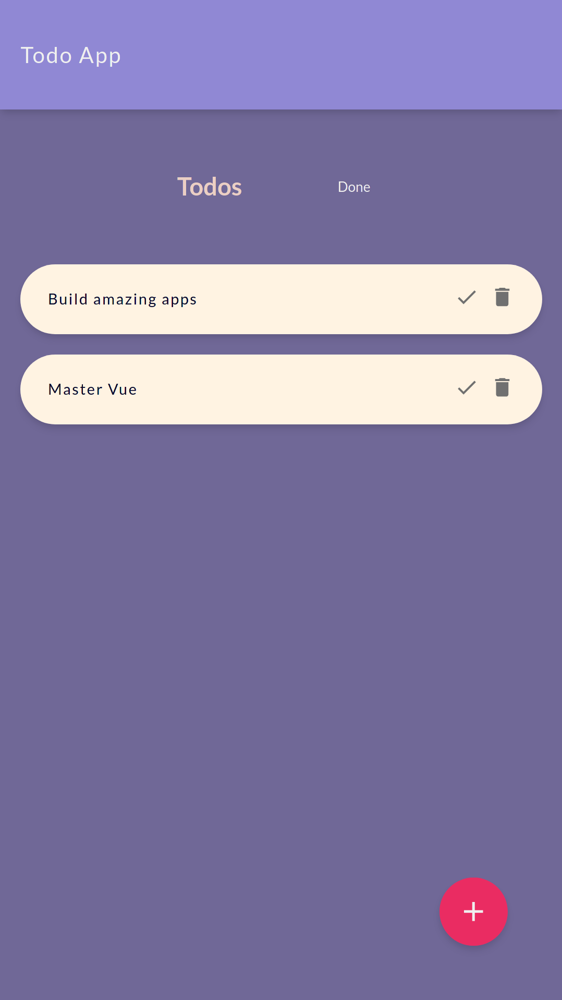
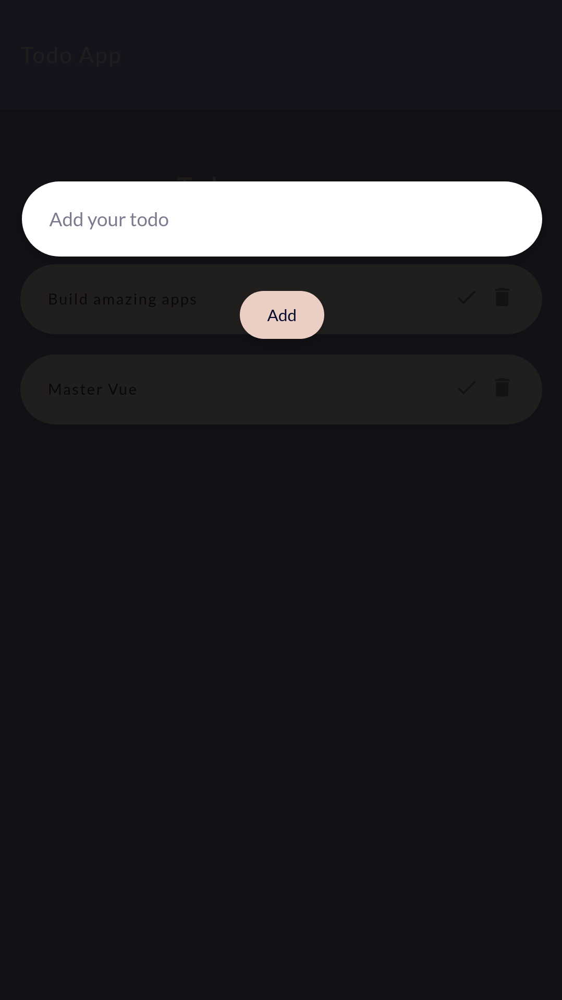
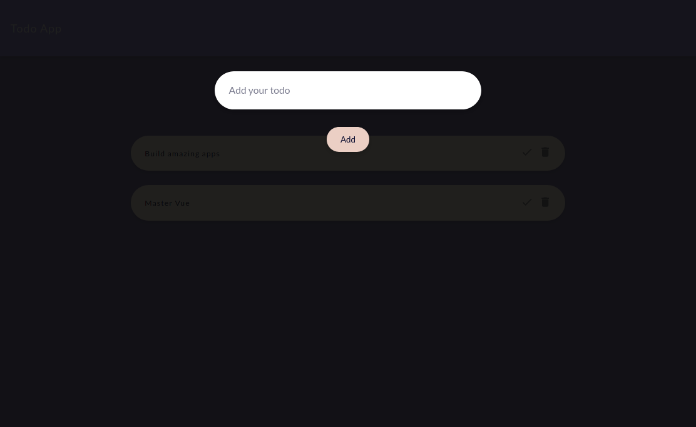

# todo-app

Todo app Simples construido com Vue

# Screenshots






## Project setup
```
yarn install
```

### Compiles and hot-reloads for development
```
yarn serve
```

### Compiles and minifies for production
```
yarn build
```